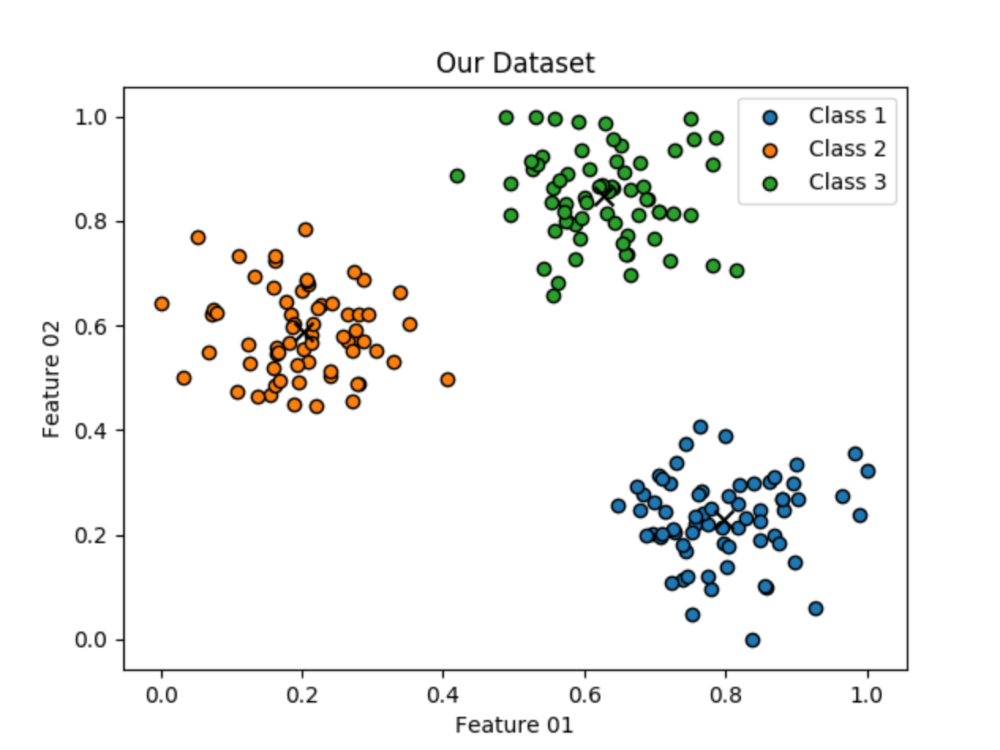

# Simple-Kmeans-Clustering-Algorithm

### Abstract
K-means is a centroid-based algorithm, or a distance-based algorithm, where we calculate the distances to assign a point to a cluster. In K-means, each cluster is associated with a centroid. The main objective of the K-Means algorithm is to minimize the sum of distances between the points and their respective cluster centroid. Here is an example of how this algorithm works:

#### To use this work on your researches or projects you need:
* Python 3.7.0
* Python packages:
	* matplotlib
	* numpy
	* scikit_learn
#

#### To install Python:
_First, check if you already have it installed or not_.
~~~~
python3 --version
~~~~
_If you don't have python 3 in your computer you can use the code below_:
~~~~
sudo apt-get update
sudo apt-get install python3
~~~~
#

#### To install packages via pip install:
~~~~
sudo pip3 install matplotlib numpy scikit_learn
~~~~
_If you haven't installed pip, you can use the codes below in your terminal_:
~~~~
sudo apt-get update
sudo apt install python3-pip
~~~~
_You should check and update your pip_:
~~~~
pip3 install --upgrade pip
~~~~
#
